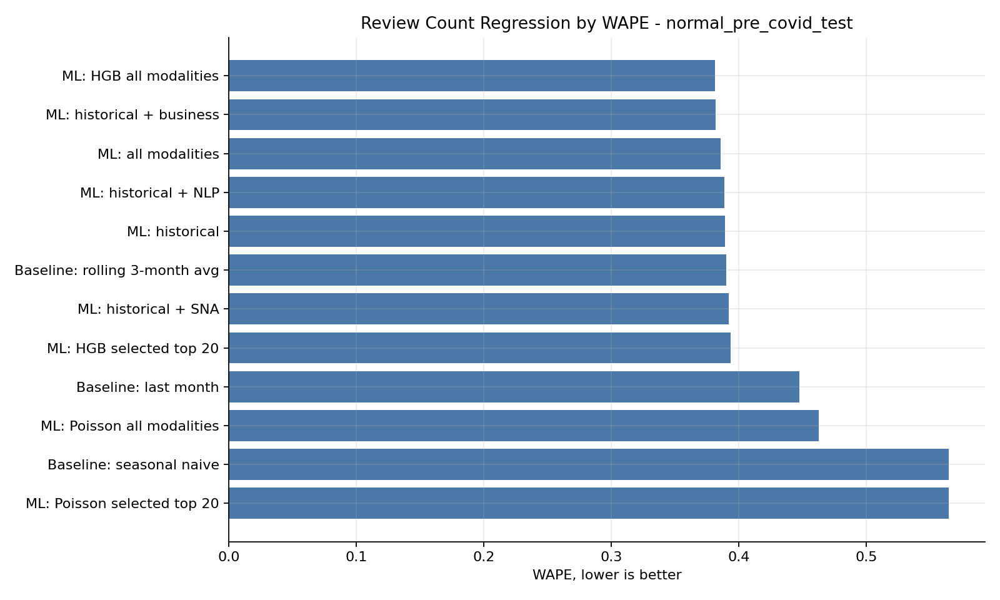

# Community Attention Forecasting with Yelp Dataset

Forecast short-term shifts in business attention using Yelp Dataset's review history, reviewer-network exposure, business category signals, and review-language features.

This started as a data-science capstone. It has been reworked into a cleaner MLE/SWE repo: reusable Python modules, CLI checks, synthetic tests, CI, leakage guardrails, and limits.

## Results



| Question | Best result | What it means |
| --- | --- | --- |
| Which model best forecasts full-cohort review counts? | Rolling 3-month baseline, WAPE **0.376** | The best simple temporal baseline beat the full-cohort ML regressors. |
| How much better is that than last-month naive? | **12.8% lower WAPE** than the last-month baseline, 0.431 -> 0.376 | Recent rolling activity is a strong, hard-to-beat signal. |
| Which model best classifies attention pulses? | HGB all modalities, F1 **0.287**, PR-AUC **0.237**, Brier **0.099** | ML adds value on the rarer spike-detection task. |
| Which model best ranks likely pulses? | HGB selected top 20, precision@10% **0.293** | The top-risk decile contains pulses at **2.51x** the base pulse rate of 0.117. |

Scope note: Prophet reaches WAPE **0.230** only on a separate 120-row top-10-business benchmark, not the 8,568-row full cohort. In the like-for-like top-10 comparison, rolling 3-month still leads at WAPE **0.162**.

## Problem

**Question:** can we predict which New Orleans businesses will receive unusually high review activity next month?

The project builds a pre-COVID business-month dataset and evaluates two tasks:

| Task | Target | Why it matters |
| --- | --- | --- |
| Review-count regression | next-month review count | Tests whether local attention volume is forecastable. |
| Attention-pulse classification | unusually high next-month activity | More useful for ranking businesses likely to spike. |

The final academic scope is pre-COVID only:

| Split | Target months |
| --- | --- |
| Train | 2015-02 to 2017-12 |
| Validation | 2018-01 to 2018-12 |
| Test | 2019-01 to 2019-12 |

Interpretation: strong temporal baselines are hard to beat for raw review counts, but all-modality ML is useful for attention-pulse detection and top-k ranking.

## Highlights

- `src/community_forecasting/` contains reusable package code for JSONL loading, chronological splits, metrics, TF-IDF helpers, output validation, and leakage checks.
- `cf-yelp` exposes portfolio-friendly commands:
  - `cf-yelp summarize-results`
  - `cf-yelp validate-outputs`
  - `cf-yelp leakage-check`
  - `cf-yelp execute-notebooks --smoke`
- `tests/` uses synthetic fixtures only, so CI does not need Yelp raw data.
- `.github/workflows/ci.yml` runs linting, formatting checks, tests, output validation, and leakage checks.
- Notebook leakage fixes now exclude Yelp snapshot rating/review-count fields from model features, fit TF-IDF vocabulary on train-window text only, and select the active cohort from train-window activity.

## Repository Structure

```text
src/community_forecasting/   importable package and CLI
tests/                       synthetic unit and integration tests
notebooks/                   narrative research workflow
outputs/                     tracked summary CSVs and figures
docs/                        data, model, and reproducibility docs
data/                        local Yelp data placeholders; raw data ignored
```

Raw, interim, and processed Yelp files are intentionally not committed. The repository tracks summary CSVs and figures that are safe to inspect without redistributing Yelp source records.

## Quickstart

Recommended:

```bash
uv sync --extra dev
uv run pytest
uv run cf-yelp summarize-results
uv run cf-yelp validate-outputs
uv run cf-yelp leakage-check
uv run cf-yelp execute-notebooks --smoke
```

For the full notebook environment, include the notebook extra:

```bash
uv sync --extra dev --extra notebooks
```

Pip fallback:

```bash
python -m pip install -e ".[dev]"
pytest
cf-yelp summarize-results
```

The full notebook pipeline requires notebook extras plus the Yelp Open Dataset JSON files in `data/raw/yelp/`. CI deliberately avoids those dependencies.

## Data

Place Yelp Open Dataset files here when reproducing locally:

```text
data/raw/yelp/
  yelp_academic_dataset_business.json
  yelp_academic_dataset_user.json
  yelp_academic_dataset_review.json
  yelp_academic_dataset_checkin.json
  yelp_academic_dataset_tip.json
```

The Yelp Open Dataset is governed by Yelp's dataset terms. This repo does not redistribute raw Yelp JSON, interim extracts, processed tables, or full prediction files.

## Notebook Workflow

```text
01_dataset_overview_and_city_selection.ipynb
02_new_orleans_data_preparation.ipynb
03_exploratory_analysis.ipynb
04_social_network_analysis.ipynb
05_time_series_feature_engineering.ipynb
06_forecasting_models.ipynb
07_results_interpretation.ipynb
```

The notebooks remain the readable research narrative. The package now owns reusable helpers and CI-safe checks.

See [docs/model_card.md](docs/model_card.md), [docs/data_card.md](docs/data_card.md), and [docs/reproducibility.md](docs/reproducibility.md) for more detail.
